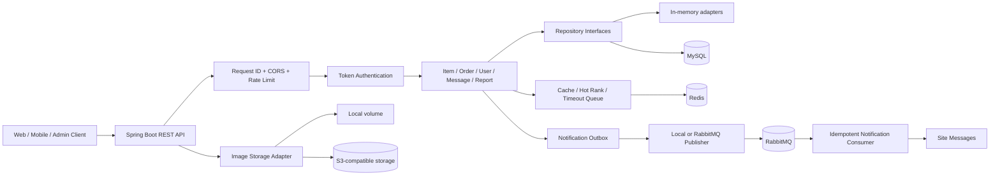

# CampusTrade Backend

CampusTrade 是一个面向校园线下二手交易的预约履约平台后端。它把“发现闲置物品、发起交易意向、卖家确认、线下交付、交易完成”组织成一条可追踪、可恢复、可扩展的业务链路，并围绕真实交易系统中最容易出问题的环节，提供状态一致性、并发控制、异步通知、缓存保护、访问风控、图片存储和生产部署能力。

项目没有把重点放在购物车、支付和物流，而是聚焦校园场景中更常见的轻量交易流程：买家先预约一个线下交易时间，卖家确认后才锁定商品，双方完成交付后关闭订单。这样的业务边界让系统可以保持单体模块化的部署效率，同时把订单、缓存、消息和风控等工程问题做深。

## 项目定位与业务闭环

CampusTrade 适用于校园二手物品、社团物资、教材交换、数码产品转让等需要“预约后线下交付”的场景。核心闭环如下：

```text
用户注册/登录
    -> 浏览、搜索和筛选在售商品
    -> 查看详情、累计热度、上传图片
    -> 买家创建预约并提交幂等键
    -> 卖家确认、拒绝或取消预约
    -> 确认时原子锁定商品，避免重复成交
    -> 超时任务自动关闭未处理订单
    -> Outbox 发布状态事件并异步写入站内消息
    -> 双方完成线下交易，商品进入 SOLD 状态
    -> 用户评价或提交举报，管理员进行治理
```

订单状态由状态机统一约束：`PENDING -> CONFIRMED -> COMPLETED` 是正常履约路径，未处理订单可以进入 `REJECTED`、`CANCELLED` 或 `EXPIRED`。商品状态和订单状态分别维护，卖家确认时通过条件更新将商品从 `ON_SALE` 原子切换为 `RESERVED`，只有成功抢占商品的订单才能继续履约。

## 功能范围

| 领域 | 已实现能力 |
| --- | --- |
| 账户与权限 | 注册、登录、退出、Token 会话、密码哈希、用户状态、`USER/ADMIN` 角色鉴权 |
| 商品 | 发布、分页检索、关键词/分类/校区/价格筛选、详情、下架、热门榜单、图片关联 |
| 交易 | 创建预约、卖家确认/拒绝、买卖双方取消、完成交易、买入/卖出订单分页查询 |
| 通知 | 订单事件 Outbox、定时发布、本地发布器、RabbitMQ 发布/消费、死信队列、消费幂等 |
| 风控 | IP/用户维度限流、预约 `X-Idempotency-Key` 防重复提交、统一异常响应 |
| 内容治理 | 举报创建、管理员处理举报、强制下架、封禁/解封用户、管理员操作日志 |
| 注册治理 | 管理员邀请码创建、分页查询、撤销、过期和使用次数校验 |
| 文件存储 | 本地持久化图片、S3 兼容对象存储适配、文件类型/大小校验、静态访问映射 |
| 运维 | Docker Compose、生产 Compose、Nginx 反向代理、systemd、Flyway、健康检查、Prometheus 指标、请求追踪 |

## 技术栈

- Java 21，使用现代 Java 语言特性和清晰的领域模块划分。
- Spring Boot 3.3.7、Spring MVC、Jakarta Validation，负责 Web 层、参数校验和应用生命周期。
- MyBatis-Plus + MySQL 8.3，提供生产持久化、分页查询、条件更新和版本化数据库迁移。
- Redis 7.2，承担详情缓存、空值缓存、热门榜单、超时 ZSet、限流计数和幂等键存储。
- RabbitMQ 3.13 + Spring AMQP，承载通知事件的异步传输、确认机制和死信处理。
- Flyway，按 `V1__...sql`、`V2__...sql` 的方式管理数据库演进。
- Micrometer + Prometheus + Spring Boot Actuator，暴露健康、指标和 Outbox 积压监控。
- springdoc-openapi，生成开发环境 Swagger UI 和 OpenAPI 文档。
- Maven、JUnit 5、Docker Compose、Apache JMeter/自研压测脚本，覆盖构建、测试和运行验证。

## 架构总览

系统采用单体模块化架构。模块在同一个 Spring Boot 进程内运行，通过接口隔离仓储、缓存、队列和对象存储实现；当业务规模扩大时，可以沿现有边界渐进拆分，而无需先重写核心领域逻辑。



应用层按业务能力拆分为 `auth`、`user`、`item`、`order`、`message`、`notification`、`risk`、`storage`、`report`、`admin` 等模块；每个模块内部尽量遵循 Controller、Service、Repository、Model/DTO 的职责边界。默认内存适配器便于快速启动，MySQL/Redis/RabbitMQ profile 提供可持久化、可扩展的运行链路。

## 关键技术实现

### 1. 订单状态机与并发一致性

`OrderStateMachine` 集中定义允许的状态迁移，Controller 不能直接修改状态。Service 在事务边界内完成权限校验、状态校验、商品抢占、订单更新、超时队列调整和 Outbox 写入。

MySQL 适配器使用带状态条件的更新，避免两个卖家请求或重复确认同时成功：

```sql
UPDATE item
SET status = 'RESERVED', version = version + 1
WHERE id = ? AND status = 'ON_SALE';
```

更新影响行数为 0 时，服务返回明确的业务冲突；`version` 字段用于记录并发修改，内存适配器也保持同样的行为契约，保证不同 profile 下业务语义一致。

### 2. Cache Aside 与缓存保护

商品详情采用 Cache Aside：先读缓存，未命中时查询仓储并回填；商品下架、卖家确认和交易完成等状态变更会主动删除详情缓存。不存在的商品写入短 TTL 空值，详情缓存 TTL 增加随机抖动，降低缓存穿透和同一时刻集中失效造成的回源压力。

详情浏览会累计热度。Redis 模式用 ZSet 保存 `item:hot:rank`，查询热门商品时按分数倒序取 Top N，再批量回源商品数据并过滤已下架商品。

### 3. Redis 超时队列

待处理预约写入 `order:timeout:zset`，score 为到期时间戳。定时任务按批次执行 Lua 脚本，原子地拉取并删除到期订单 ID，随后由订单服务再次检查数据库状态并执行 `PENDING -> EXPIRED`。数据库状态是最终依据，队列只负责提高调度效率，因此重复触发不会重复取消。

### 4. Outbox、RabbitMQ 与消费幂等

订单主事务只写 `notification_outbox`，不在用户请求线程中同步等待消息系统。后台任务扫描 `PENDING` 事件并发布，发布成功后标记 `PUBLISHED`，失败则增加重试次数并记录下次执行时间；超过上限进入失败状态，便于运维处理。

RabbitMQ 发布器开启 publisher confirm、returned-message 检测和手动 ACK，通知队列配置死信交换机和死信队列。消费者以 `eventId` 作为幂等键写入站内消息，即使消息重复投递，也不会产生重复通知。开发环境可使用本地发布器验证链路，生产环境切换 RabbitMQ profile。

### 5. 限流与防重复提交

登录、注册等公开接口按 IP 限流，预约和订单操作按用户 ID 限流。Redis 实现通过 Lua 脚本保证计数、过期时间和首次写入的原子性；无 Redis 时使用内存实现，便于单机开发。

创建预约支持 `X-Idempotency-Key`。服务先以 `SET NX EX` 抢占幂等键，重复请求会被拒绝或返回已有结果，避免移动网络重试、浏览器重复点击造成多张预约单。

### 6. 图片存储抽象

`ImageStorageClient` 将业务与存储介质隔离：默认写入本地持久化目录，也可以通过 `APP_STORAGE_TYPE=s3` 切换到 MinIO、OSS、COS 等 S3 兼容服务。上传接口校验 MIME 类型和大小，生产 Compose 使用 `uploads-data` 卷持久化本地图片，并预留 CDN 公网地址配置。

### 7. 可观测性与生产安全

每个请求生成或透传 `X-Request-Id`，日志包含请求 ID、耗时和慢请求提示，便于跨接口定位问题。Actuator 暴露健康、指标和 Prometheus 端点，Outbox 提供待发布、到期和失败事件 Gauge。`prod` profile 默认关闭 Swagger、关闭演示数据，并在启动时拒绝示例密码、空密码、占位 CORS 和不安全的 bootstrap 配置。

## 数据模型

核心表由 Flyway 迁移脚本创建，主要关系如下：

```text
user ──< item ──< item_image
  │       │
  │       └──< trade_order ──< order_event
  │                         └──< review
  ├──< message
  ├──< report
  └──< admin_operation_log

notification_outbox 记录订单事件到消息系统之间的可靠投递状态
invite_code          控制注册入口的灰度开放和使用次数
favorite / browse_history 支撑用户行为扩展
```

数据库设计与迁移脚本：

- [数据库结构说明](docs/schema.sql)
- [V1 初始结构](src/main/resources/db/migration/V1__init_schema.sql)
- [V2 商品检索索引](src/main/resources/db/migration/V2__add_item_search_indexes.sql)
- [V3 邀请码](src/main/resources/db/migration/V3__add_invite_code.sql)
- [V4 订单消息分页索引](src/main/resources/db/migration/V4__add_order_message_pagination_indexes.sql)

## API 能力

所有接口返回统一结构 `{ code, message, data }`，受保护接口使用 `Authorization: Bearer <token>`。主要资源如下：

| 资源 | 代表接口 |
| --- | --- |
| 认证 | `POST /api/auth/register`、`POST /api/auth/login`、`POST /api/auth/logout` |
| 用户 | `GET /api/users/me` |
| 商品 | `POST/GET /api/items`、`GET /api/items/{id}`、`GET /api/items/hot`、`PUT /api/items/{id}/off-shelf` |
| 预约订单 | `POST /api/items/{itemId}/appointments`、`POST /api/orders/{orderId}/confirm`、`reject`、`cancel`、`complete` |
| 订单查询 | `GET /api/orders/my-buy`、`GET /api/orders/my-sell` |
| 消息 | `GET /api/messages`、`PUT /api/messages/{id}/read` |
| 文件 | `POST /api/files/images` |
| 举报 | `POST /api/reports` |
| 管理 | `/api/admin/reports`、`/api/admin/users`、`/api/admin/items`、`/api/admin/invite-codes` |

完整请求字段、枚举和示例见 [API 文档](docs/api.md)。开发环境启动后可通过 [Swagger UI](http://localhost:8080/swagger-ui.html) 交互式调用。

## 快速开始

### 环境要求

- JDK 21+
- Maven 3.9+
- Docker Desktop（只在启用 MySQL、Redis、RabbitMQ 或 MinIO 时需要）

### 内存模式

内存模式无需外部中间件，适合快速验证接口和业务流程：

```bash
mvn spring-boot:run
```

默认演示账号为 `seller / 123456`、`buyer / 123456`、`admin / 123456`。生产环境会关闭演示数据初始化。

### 完整依赖链路

```bash
docker compose up -d mysql redis rabbitmq
mvn spring-boot:run "-Dspring-boot.run.arguments=--spring.profiles.active=mysql,redis,rabbitmq"
```

MySQL 映射到本机 `33306`，RabbitMQ 管理台为 `http://localhost:15672`（本地默认账号 `guest / guest`）。如需验证 S3 兼容对象存储：

```bash
docker compose --profile object-storage up -d minio minio-init
```

### 构建和测试

```bash
mvn test
mvn -DskipTests package
```

## 部署与运维

项目提供单机 Docker Compose 和 Linux systemd 两种部署路径。生产环境建议将密码、域名、CORS、对象存储和管理员 bootstrap 配置放在未提交的 `.env.prod` 中：

```bash
Copy-Item .env.prod.example .env.prod
docker compose --env-file .env.prod -f docker-compose.prod.yml up -d --build
```

生产 Compose 包含 Spring Boot、MySQL、Redis、RabbitMQ 和 Nginx，服务之间通过内部网络通信，数据库、缓存和 MQ 不直接暴露公网。数据库升级使用 Flyway，应用容器启用优雅停机和健康检查，图片目录通过卷持久化。

详细资料：

- [服务器部署指南](docs/server-deployment-guide.md)
- [上线检查清单](docs/go-live-checklist.md)
- [生产安全自检](docs/production-safety.md)
- [可观测性运行手册](docs/observability-runbook.md)

## 压测与验证

项目提供 PowerShell、Node.js 和 JMeter 脚本，覆盖商品浏览、热门榜单、预约并发、订单确认、异步通知和全链路 profile。示例：

```powershell
docker compose up -d mysql redis rabbitmq
mvn -DskipTests package
powershell -ExecutionPolicy Bypass -File scripts\run-pressure-test.ps1 `
  -Profile "mysql,redis,rabbitmq" `
  -ScenarioRequests 300 `
  -Concurrency 30 `
  -AppointmentRequests 12 `
  -AsyncDrainSeconds 8
```

脚本会生成 JSON 和 Markdown 结果，报告中同时记录环境、请求模型、成功率、延迟和异步排空情况。压测结果用于回归和容量基线，不把单机数据直接等同于线上容量承诺。

- [压测计划](docs/pressure-test-plan.md)
- [压测报告](docs/pressure-test-report.md)
- [压测脚本目录](scripts/)

## 项目价值

### 对用户和场景的价值

校园交易通常发生在同一校区，买卖双方更关心交易地点、时间确认和临时变更，而不是复杂的物流链路。预约履约模型把交易意向、资源锁定和线下交付拆开，降低爽约、重复确认和状态不透明带来的沟通成本。举报、封禁、邀请码和管理员审计又为校园社区提供了基本的治理闭环。

### 对工程质量的价值

项目把常见的“能跑通”接口提升为可解释、可恢复的后端链路：状态机让业务规则集中；条件更新和版本号处理并发；Cache Aside 与空值缓存保护数据库；Outbox 把主事务和消息投递解耦；RabbitMQ 确认、重试和死信提高异步链路可靠性；限流和幂等键保护入口；Actuator、请求 ID 和指标让问题可以被定位。每项设计都对应明确的故障场景，而不是为了堆叠中间件。

### 对后续产品化的价值

模块化结构、Repository/Cache/Storage 接口和 profile 化配置为前端接入、移动端接入、多校区部署和服务拆分保留了演进空间。系统可以在保持单体部署简单性的同时，逐步替换内存组件、接入托管基础设施，并根据实际流量和团队边界拆分服务。

## 发展路线

后续演进按“先完善交易体验，再增强平台治理，最后做规模化基础设施”的顺序推进：

1. **交易体验**：补充买卖双方评价、收藏、浏览历史、交易地点模板、预约时间段和消息已读统计，完善移动端友好的分页与错误码。
2. **治理与风控**：增加敏感词和图片审核、举报证据、管理员操作审计查询、异常行为画像、黑名单和更细粒度的权限策略。
3. **可靠性增强**：为超时队列增加 processing 集合与失败补偿，引入 Outbox 重试后台、消息积压告警、缓存删除补偿和数据库慢查询治理。
4. **存储与交付**：默认迁移到 S3/MinIO + CDN，增加图片压缩、缩略图、病毒扫描和断点上传，降低应用节点本地磁盘依赖。
5. **性能与容量**：基于压测基线优化索引、连接池、分页查询和热点缓存；在多实例部署后完善 Redis 分布式锁、任务分片和限流配额。
6. **服务化演进**：当用户量、团队规模和发布频率达到拆分条件时，优先将通知、文件、治理等边界清晰的模块独立为服务，再评估订单与商品服务化，避免过早引入分布式事务和运维复杂度。

## 文档索引

- [架构设计](docs/architecture.md)
- [API 清单](docs/api.md)
- [Redis 缓存设计](docs/redis-cache-design.md)
- [超时订单队列设计](docs/order-timeout-queue-design.md)
- [RabbitMQ + Outbox 设计](docs/rabbitmq-outbox-design.md)
- [接口限流与幂等设计](docs/rate-limit-idempotency-design.md)
- [数据库结构](docs/schema.sql)
- [生产安全自检](docs/production-safety.md)
- [可观测性运行手册](docs/observability-runbook.md)

## 许可证与贡献

当前仓库主要用于校园交易后端的工程实践与持续迭代。提交 Issue 或 Pull Request 时，建议同时说明业务背景、数据一致性影响、配置变更、迁移脚本和验证结果；涉及生产配置的内容请使用环境变量，不要提交真实密码、证书或访问密钥。
