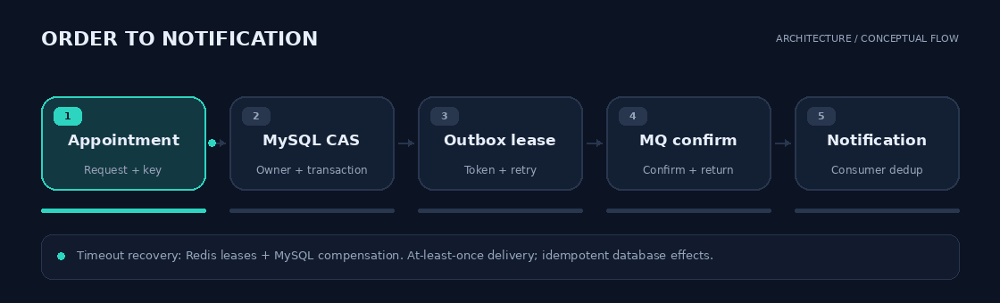
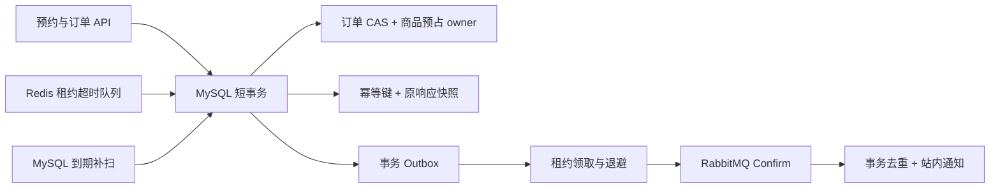

<div align="center">


# CampusTrade

**从预约到履约，把校园二手交易做成可恢复的业务链路。**

[](pom.xml)
[](pom.xml)
[](docs/trade-consistency-and-idempotency.md)
[](docs/order-timeout-queue-design.md)
[](docs/reliable-notifications.md)
[](docs/highlights-verification.md)

[项目亮点](#项目亮点) · [链路与架构](#链路与架构) · [快速开始](#快速开始) · [验证结果](#验证结果) · [文档导航](#文档导航)

</div>

---

CampusTrade 是 Java / Spring Boot 校园交易后端。买家预约线下时间，卖家确认后预占商品，交付完成后关闭订单；超时调度、异步通知、风控与运营治理围绕这条业务链路展开。

## 项目亮点

| 能力 | 关键技术 | 可以解释的工程问题 |
| :--- | :--- | :--- |
| **交易一致性与幂等** | MySQL 条件更新、短事务、预占 owner、请求响应快照 | 同商品竞争只允许一个确认；请求重试返回原结果 |
| **可恢复超时调度** | Redis 双 ZSet、Lua token 领取 / ACK、租约回收、数据库补扫 | 领取后崩溃、队列丢失、Redis 故障后的任务恢复 |
| **可靠事件通知** | Outbox 租约、SKIP LOCKED、Confirm / Returns、消费事务去重 | 重复传输只产生一次通知落库效果；失败与死信支持审计重放 |

账户鉴权、商品检索、图片存储、举报治理、管理员邀请码、限流和指标也已实现。完整模块与接口说明见[详细项目指南](docs/project-guide.md)。

## 链路与架构



*动图为架构示意；超时关闭走 Redis 租约与 MySQL 补偿支路。*

<details>
<summary><strong>展开静态架构图</strong></summary>



</details>

## 快速开始

需要 **JDK 21、Maven 3.9+**；完整依赖模式需要 Docker Compose。

### 轻量体验

```bash
mvn spring-boot:run
```

内存模式不需要外部中间件。开发演示账户：`seller / 123456`、`buyer / 123456`、`admin / 123456`。访问 [Swagger UI](http://localhost:8080/swagger-ui.html)。

### 真实依赖

```bash
docker compose up -d mysql redis rabbitmq
mvn spring-boot:run "-Dspring-boot.run.arguments=--spring.profiles.active=mysql,redis,rabbitmq"
```

默认本地 MySQL 端口 `33306`，RabbitMQ 管理台 `15672`。S3 兼容存储、生产配置和 systemd 部署见[部署指南](docs/server-deployment-guide.md)。

### 构建与验证

```bash
mvn verify
```

真实依赖测试需启用对应环境变量，并使用隔离测试库和专用 broker；完整复现方式见[验收记录](docs/highlights-verification.md)。

## 验证结果

**2026-10-09：真实 MySQL、Redis、RabbitMQ 验证共 115 项测试通过，0 失败、0 错误、0 跳过。** 徽章记录本次实测，不代表持续集成状态。

| 实验 | 实测结果 |
| :--- | :--- |
| 24 订单争用一个商品 | 只确认一个；冲突事务回滚 |
| 24 个相同幂等键请求 | 一个订单、一份 Outbox，返回原响应 |
| 领取后 / 提交后 ACK 前 SIGKILL | 租约与补偿恢复，无重复业务效果 |
| MQ 重复投递与 broker stop/start | 重复消息去重，故障后恢复投递 |
| DLQ 重放与审计失败 | 保留 event_id，审计回滚时不丢死信 |

报告、复现步骤和简历表述见[亮点验收记录](docs/highlights-verification.md)。以上是并发正确性和故障恢复实验，未据此声明生产 QPS 或集群高可用。

## 文档导航

| 阅读目的 | 文档 |
| :--- | :--- |
| 理解业务、模块与接口 | [详细指南](docs/project-guide.md) · [API 清单](docs/api.md) · [架构](docs/architecture.md) |
| 理解交易正确性 | [事务、预占与请求幂等](docs/trade-consistency-and-idempotency.md) |
| 复现超时故障 | [队列协议](docs/order-timeout-queue-design.md) · [SIGKILL 实验报告](docs/experiments/order-timeout-recovery-report.md) |
| 理解通知链路 | [发布租约、消费去重与死信重放](docs/reliable-notifications.md) |
| 部署与观测 | [部署指南](docs/server-deployment-guide.md) · [运行手册](docs/observability-runbook.md) |
| 评测与成果 | [验收记录](docs/highlights-verification.md) · [压测脚本](scripts/) |

<details>
<summary><strong>部署边界与后续增强</strong></summary>

- 内存模式不提供进程重启后的业务持久性；持久化验证使用 MySQL profile。
- 历史 DATETIME 切换为 UTC 前须核对旧数据语义；RabbitMQ v2 队列升级须排空旧积压并处理原 DLQ。具体步骤见对应设计文档。
- 后续继续建设生产告警、容量基线、缓存补偿和更细粒度权限。

</details>

---

同作者项目：[StudyFlow — 资料检索与证据问答](https://github.com/wangbf123/StudyFlow)
