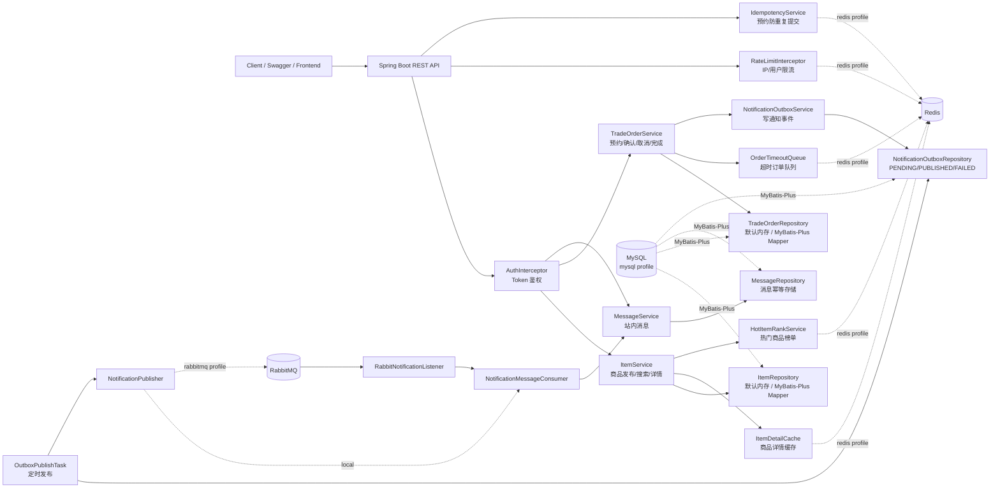
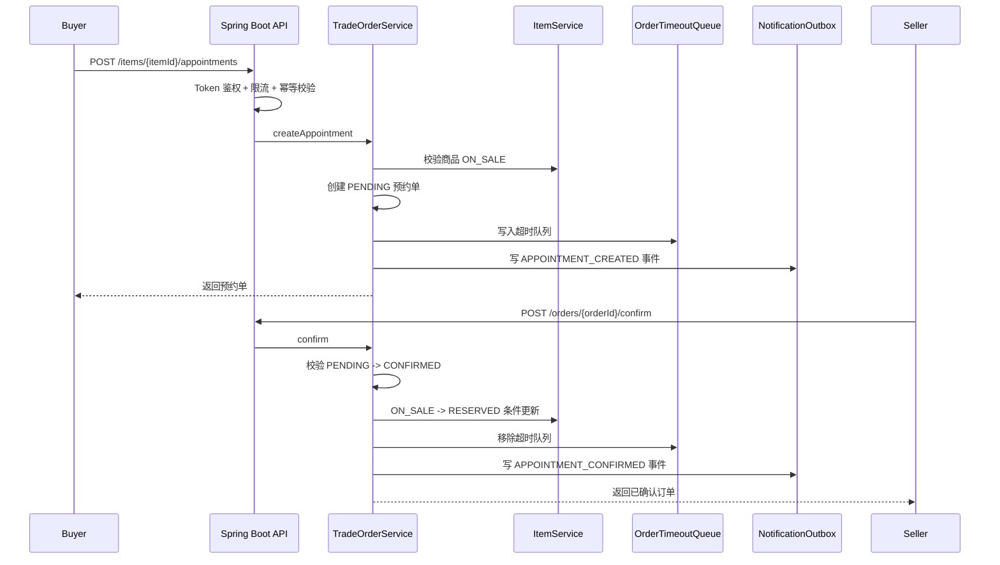
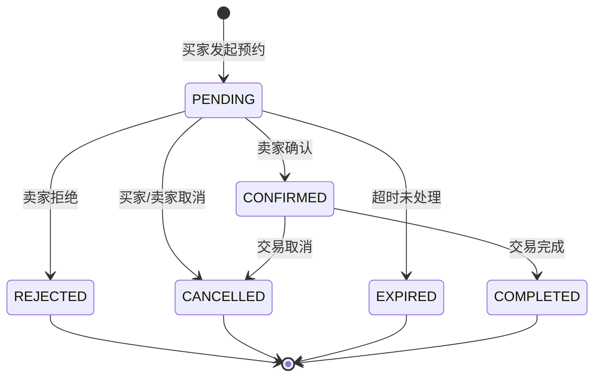
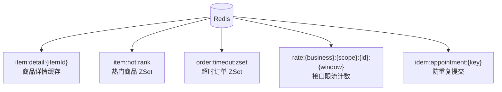
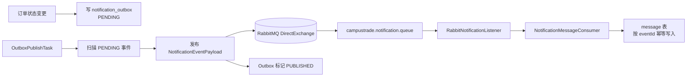
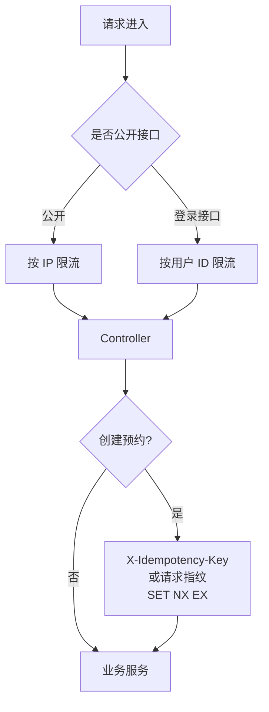

# CampusTrade 架构设计

## 总体架构



## 核心业务流程



## 订单状态机



状态变更不是直接覆盖字段，而是先由 `OrderStateMachine` 校验，再通过条件更新保证并发安全：

```sql
UPDATE trade_order
SET status = 'CONFIRMED', version = version + 1
WHERE id = ? AND status = 'PENDING';
```

商品预约抢占同理：

```sql
UPDATE item
SET status = 'RESERVED', version = version + 1
WHERE id = ? AND status = 'ON_SALE';
```

## Redis 使用点



## RabbitMQ + Outbox 链路



Outbox 解决的问题：

- 订单主流程不等待通知发送。
- MQ 临时不可用时，事件保留为 `PENDING`，后台任务继续重试。
- 消费者通过 `eventId` 保证幂等，避免重复通知。

## 限流与防重复提交



## 架构阅读路径

建议先从业务闭环和订单状态机开始，再阅读 Redis 缓存/超时队列以及 RabbitMQ + Outbox 链路，最后查看限流、幂等和生产可观测性。这样的顺序可以先建立领域模型，再理解基础设施如何围绕一致性、可靠性和吞吐量提供支撑。
