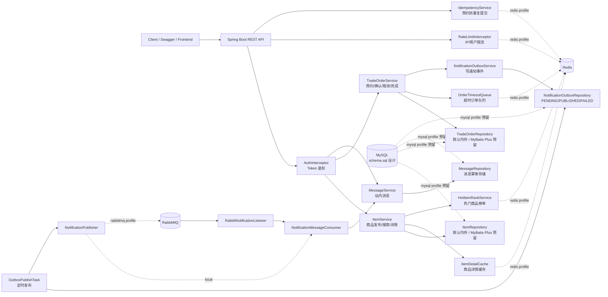
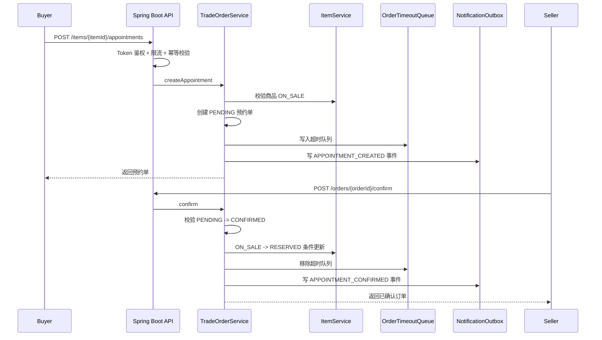
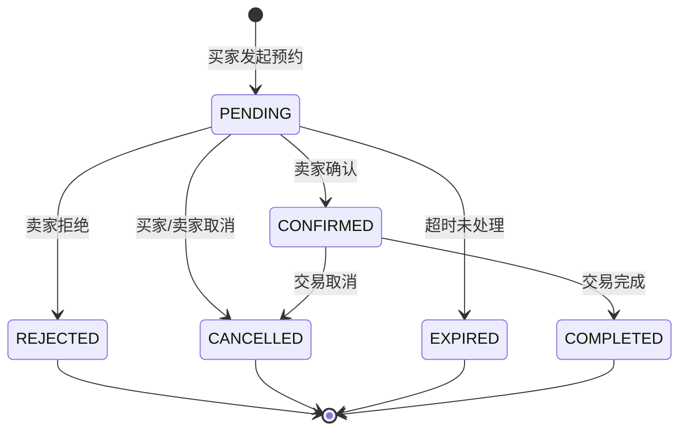
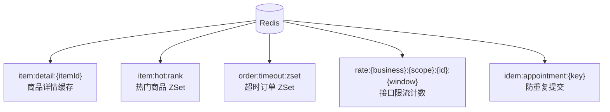
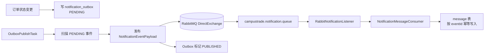
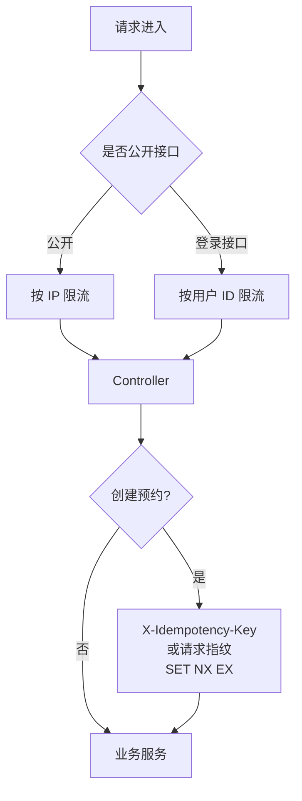

# CampusTrade 架构设计

## 总体架构



## 核心业务流程



## 订单状态机



状态变更不是直接覆盖字段，而是先由 `OrderStateMachine` 校验，再通过条件更新保证并发安全：

```sql
UPDATE trade_order
SET status = 'CONFIRMED', version = version + 1
WHERE id = ? AND status = 'PENDING';
```

商品预约抢占同理：

```sql
UPDATE item
SET status = 'RESERVED', version = version + 1
WHERE id = ? AND status = 'ON_SALE';
```

## Redis 使用点



## RabbitMQ + Outbox 链路



Outbox 解决的问题：

- 订单主流程不等待通知发送。
- MQ 临时不可用时，事件保留为 `PENDING`，后台任务继续重试。
- 消费者通过 `eventId` 保证幂等，避免重复通知。

## 限流与防重复提交



## 面试讲解顺序

推荐按这个顺序讲，逻辑最顺：

1. 先讲业务：校园二手交易不是完整电商，核心是线下预约履约。
2. 再讲订单状态机：用状态机限制非法流转，用条件更新解决并发修改。
3. 接着讲 Redis：商品详情缓存、热门商品榜单、超时订单队列。
4. 再讲 MQ：Outbox 解耦订单状态变更和通知发送，eventId 做消费幂等。
5. 最后讲风控：限流和幂等键防刷接口、防重复预约。
