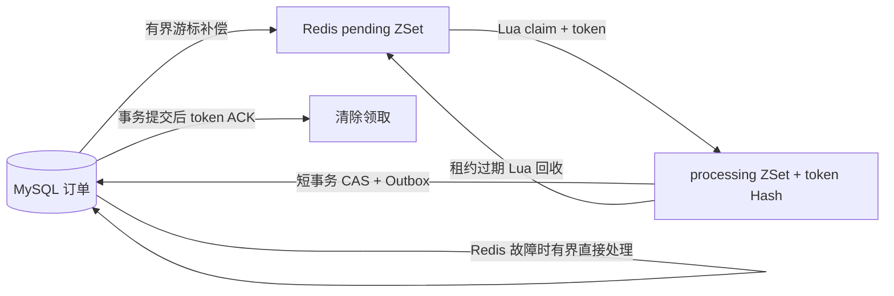

# 可恢复的订单超时调度

订单的 `PENDING` 状态和 `expire_at` 保存在 MySQL；Redis 只加速任务调度。队列采用至少一次领取，数据库条件更新与同事务 Outbox 提供一次业务状态变更效果。

## 领取协议

- 默认键为 `{order-timeout}:pending`、`{order-timeout}:pending:processing`、`{order-timeout}:pending:tokens`，共享 Redis Cluster hash tag。
- pending 的 score 是 UTC 到期时间戳；processing 的 score 是租约截止时间。Lua 原子移动任务并写入唯一领取 token。
- 同一订单在有效领取期间不能再次入队。数据库补偿只补缺失任务，不覆盖已有任务的重试退避。
- 业务处理使用 MySQL `status = 'PENDING' AND expire_at <= CURRENT_TIMESTAMP(6)` 条件更新；连接 session 固定 UTC。订单状态与两个通知 Outbox 记录在同一短事务中提交。
- `TransactionTemplate.execute` 返回后才 ACK。ACK/retry 必须匹配当前 token；回收后的旧消费者不能删除或重新排期新领取。
- 领取后进程退出：租约到期后回收。数据库提交后 ACK 前退出：再次领取会看到终态，直接 ACK，不新增 Outbox。
- 队列意外提前触发时，仍为 PENDING 的订单重新排到数据库截止时间，不能提前关闭。
- 用户主动确认、拒绝、取消、完成后移除任务；这一清理允许无 token，因为用户事务已经改变权威业务状态。

## 数据库补偿与故障降级

每轮最多扫描 `recovery-batch-size` 条，按 `(expire_at, id)` 游标前进，扫描结束后重置游标。即使最早一批订单持续重试/处理中，也不会永久遮挡后面的订单。提前 `lookahead-seconds` 补齐近期到期任务，恢复“数据库提交成功但 afterCommit 入队失败”的情况。

V1 已有 `idx_order_status_expire(status, expire_at)`。InnoDB 二级索引包含主键 `id`，支持该游标的 `(status, expire_at, id)` 顺序，无需增加重复索引。

Redis 领取失败时，每次最多从 MySQL 处理 `batch-size` 条到期订单，同样采用游标轮巡。Redis 恢复后自动重建队列。数据库本身不可用时不伪装成功，任务留在数据库待下轮恢复。

所有队列时间使用 UTC；MySQL/JDBC session 也应配置 UTC。生产机器需保持时钟同步。租约不限制业务事务继续执行，迟到消费者仍由数据库 CAS 与 token fencing 防止重复副作用。配置周期不是恢复耗时保证，积压和数据库性能会影响尾部延迟。

## 配置与监控

| 配置 | 默认值 | 用途 |
|---|---:|---|
| `app.order-timeout.scan-delay` | 60000 ms | 领取/处理周期 |
| `batch-size` | 50 | 单轮处理/数据库降级上限 |
| `lease-seconds` | 120 s | 领取租约 |
| `retry-delay-seconds` | 60 s | 可捕获失败后退避 |
| `recovery-delay` | 10000 ms | 回收与补偿周期 |
| `recovery-batch-size` | 500 | 每轮回收/扫描上限 |
| `lookahead-seconds` | 60 s | 提前补齐近期任务 |

Micrometer 指标前缀 `campustrade.order.timeout`：

- counters：`claimed`、`recovered`、`compensated`、`retried`、`expired`、`backend.failures`、`fallback.processed`。
- gauges：`pending`、`processing`、`expired.leases`、`oldest.due.age`、`scan.last.success`、`queue.available`。
- timer：`close.delay`，记录数据库截止时间到成功关闭的延迟，并导出直方图。

Gauges 由扫描采样，Prometheus 抓取不会触发 Redis 请求；扫描失败后队列数据为 NaN，避免旧的零积压冒充健康。可对扫描超过三轮未成功、最老任务年龄超过业务SLO、积压持续增长设置告警。不得以订单 ID 或 token 作为标签。

## 运行验证

普通单测运行 `mvn test`。真实 Redis 协议测试启用 `CAMPUS_REDIS_IT=true`。真实 MySQL + Redis 故障测试启用 `CAMPUS_MYSQL_IT=true`，并通过安全环境变量绑定 `CAMPUS_MYSQL_IT_PASSWORD`；可配置 `CAMPUS_MYSQL_IT_ADMIN_URL`、`CAMPUS_MYSQL_IT_USER`、`CAMPUS_REDIS_IT_HOST/PORT`。

默认只连接本地 MySQL 3307、Redis 6379。测试账号必须有创建/删除隔离数据库的权限；远程数据库请提供经过 TLS 验证的 JDBC URL。测试创建随机 `campus_timeout_it_*` 数据库与 Redis namespace，只删除自己的资源，不执行 FLUSHDB。

真实故障测试会启动子 JVM，并在确认两个边界后通过 `destroyForcibly`（Linux SIGKILL）退出：

1. claim 完成、数据库事务尚未执行；重启处理后订单 EXPIRED，两个 Outbox 事件。
2. 订单状态与 Outbox 已提交、ACK 尚未执行；回收后再处理保持 EXPIRED，Outbox 仍然只有两个事件。

另覆盖清空自己的队列、漏入队、Redis 连接故障降级、提前触发；Redis 协议测试覆盖四 worker 竞争 80 个任务、旧 token ACK/retry、重试退避、租约边界和跨主机时区。

简历可描述已实现和通过测试的机制；不能根据这组正确性测试虚构吞吐或恢复 SLO。
